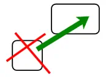

## Keyboard Deconvolutor

Keyboard Deconvolutor is a system application used to remap low-level keyboard scan codes for different systems

[Application Help](https://sakryukov.github.io/keyboard-deconvolutor/code/Application/Resources/help.html)

See also: [Кeyboard Layout Аssistant](https://github.com/SAKryukov/keyboard-layout-assistant)